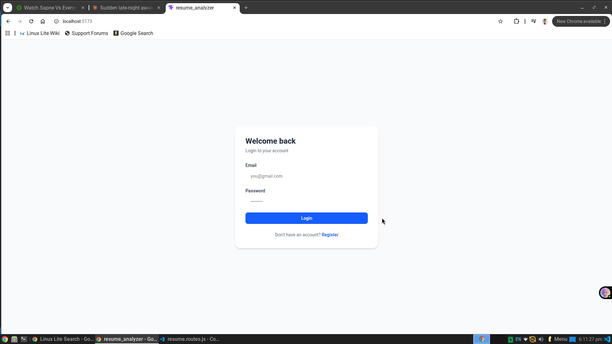

# 🧠 AI Resume Analyzer

An AI-powered full stack web application that analyzes resumes, provides improvement suggestions, and matches them against job descriptions with a relevance score.

---

## 🚀 Features

- 📄 Upload resume as PDF and extract text automatically
- 🤖 AI-powered resume analysis with actionable suggestions
- 🎯 Match resume against a job description with a score
- 🔐 Secure authentication with JWT
- 📊 View past analysis history
- 📱 Responsive UI built with React and Tailwind CSS

---

## 🛠️ Tech Stack

**Frontend**
- React
- Redux
- Tailwind CSS
- Axios

**Backend**
- Node.js
- Express
- MongoDB + Mongoose
- JWT Authentication
- Multer (file uploads)
- pdf-parse (PDF text extraction)
- OpenAI / Gemini API (AI analysis)

**Deployment**
- Frontend → Vercel
- Backend → Render

---

## 📁 Project Structure

```
resume-analyzer/
├── backend/
│   ├── config/
│   │   ├── db.js
│   │   ├── jwt.js
│   │   └── multer.js
│   ├── controllers/
│   │   ├── auth.controller.js
│   │   └── resume.controller.js
│   ├── middleware/
│   │   └── auth.middleware.js
│   ├── models/
│   │   ├── user.model.js
│   │   └── resume.model.js
│   ├── routes/
│   │   ├── auth.routes.js
│   │   └── resume.routes.js
│   ├── .env.example
│   ├── package.json
│   └── server.js
├── frontend/
│   ├── src/
│   │   ├── components/
│   │   ├── pages/
│   │   ├── redux/
│   │   └── App.jsx
│   └── package.json
├── screenshots
├── .gitignore
└── README.md
```

---

## ⚙️ Getting Started

### Prerequisites
- Node.js v18+
- MongoDB (local or Atlas)
- OpenAI API key or Gemini API key

### 1. Clone the repository
```bash
git clone https://github.com/aaquib-anzar/resume-analyzer.git
cd resume-analyzer
```

### 2. Setup Backend
```bash
cd backend
npm install
```

Create a `.env` file in the `backend/` folder:
```env
PORT=5000
NODE_ENV=development
MONGO_URI=your_mongodb_connection_string
JWT_SECRET=your_jwt_secret
JWT_EXPIRES_IN=7d
OPENAI_API_KEY=your_openai_api_key
```

Start the backend server:
```bash
npm run dev
```

### 3. Setup Frontend
```bash
cd frontend
npm install
npm run dev
```

---

## 🔗 API Endpoints

### Auth
| Method | Endpoint | Description | Protected |
|--------|----------|-------------|-----------|
| POST | `/api/auth/register` | Register a new user | No |
| POST | `/api/auth/login` | Login user | No |
| POST | `/api/auth/logout` | Logout user | No |
| GET | `/api/auth/profile` | Get current user | Yes |

### Resume
| Method | Endpoint | Description | Protected |
|--------|----------|-------------|-----------|
| POST | `/api/resume/upload` | Upload and parse PDF | Yes |
| POST | `/api/resume/analyze` | Analyze resume with AI | Yes |
| POST | `/api/resume/match` | Match resume with job description | Yes |
| GET | `/api/resume/history` | Get past analyses | Yes |

---

## 🖼️ Screenshots

> 
> 
> 
> 
> 

---

## 🧪 Testing APIs

You can test all endpoints using [Postman](https://www.postman.com/).

1. Register a user via `POST /api/auth/register`
2. Login to get the token cookie set
3. Use protected routes with the cookie automatically sent

---

## 🌱 Future Improvements

- [ ] Google OAuth login
- [ ] Export improved resume as PDF
- [ ] Resume templates
- [ ] Email notifications

---

## 👨‍💻 Author

**Aaquib Anzar**
- Portfolio: [aaquib.vercel.app](https://aaquib.vercel.app)
- GitHub: [@aaquib-anzar](https://github.com/aaquib-anzar)
- LinkedIn: [aaquib-anzar](https://linkedin.com/in/aaquib-anzar-519771170)
- ProjectLink: [aaquib-anzar](https://resume-analyzer-nine-amber.vercel.app/)

---
